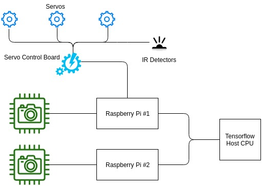
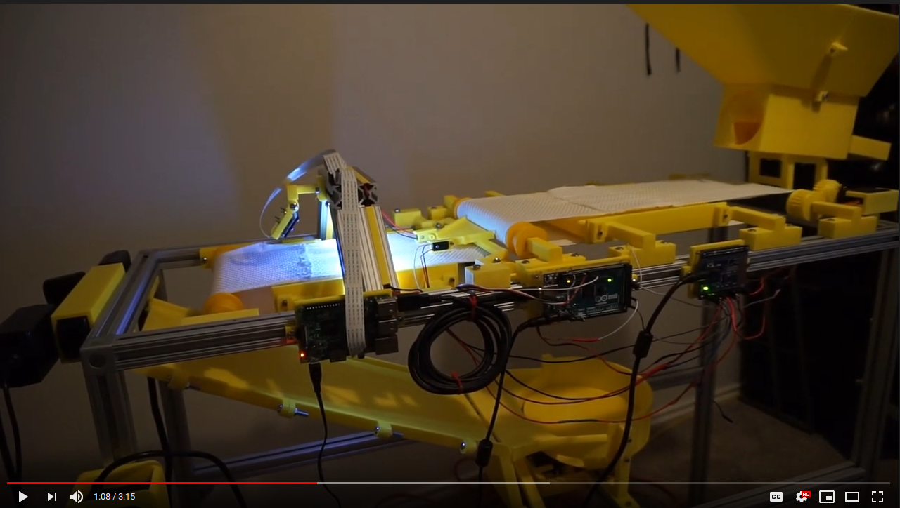

# element-tag-separate
LEGO Element Image Based Sorting Smart Assistant

# Introduction
The element sorter is an automated system to identify and respectively sort
LEGO elements using an image convolutional neural network (CNN). The system is distributed onto four different 
OS/Hardward platforms: Ubuntu, RaspberryPi controller (Raspbian Stretch), RaspberryPi camera, Arduino. 

The Ubuntu platform hosts the TensorFlow recognition system as well as a web server through Django. 

The Raspberry Pi controller runs three different processes as services:
1. Flask web server - Receives commands and requests from the Django-based web client. Passes commands to Arduino controller process.  
2. Arduino controller - Receives commands from flask and passes serial commands to the Raspberry Pi.
3. Video stream - Accesses the camera resource and streams video in MJPEG format.

The Raspberry Pi camera runs only the Video stream as it does not need to communicate actively with any other system.

The Arduino platform controls all servos, sensors, and LED lighting.

# System Layout

---
# Getting Started
This repo is divided into two sets of code. The "tensorhost" code will be placed on the Ubuntu platform. The 
"raspberry_controller" will be placed on the Raspberry Pi platform. For more explanation of setup, please refer to the
documentation in each respective folder

---
# System Process Workflow
## Capture
After a block model is created in the database, the automatic system can take photos of the model from the mounted cameras.
Since this process is automated, the user will only need to fill the hopper with the same part and allow the system to feed through the parts.
The entire capture process is controlled through the web ui.
## Training
Once a enough captures of blocks are taken (200+), it is possible to train a new neural network. The process is automated
through the web ui. The Django backend view will create the appropriate file/folder structure and then spawn a new thread
responsible for training the network.
## Sorting
When fed from the bulk feeder, the part will tagged with a confidence interval by the respective trained CNN. 
If the element is recognized with an appropriate confidence interval it will be assigned a position based on the profile mapping.
The position will correlate to a physical bin where the block will be sorted.
---
# GUI Interface
For an in-depth explanation, please see the following youtube video explaining how the web ui interact with the system.

[(https://youtu.be/cp-qN7oeIuc "Lego Element Sorter")]

* Link youtube video
* Learning for adding parts
* Mode for Separate (Category, Part Number, Color)
* Advanced Mode for Set Detection
